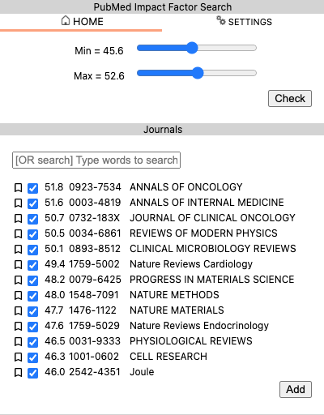
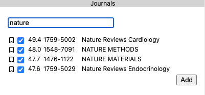
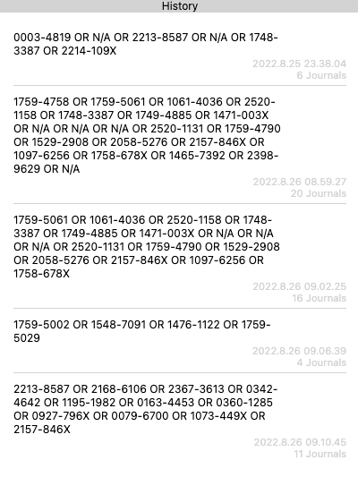

# PubMed Impact Factor Search

Add search words of journals at PubMed which has the impact factors you specified

# Installation

(1) Install PIFS from [Chrome Webstore](https://chrome.google.com/webstore/detail/pubmed-impact-factor-sear/amhcplabblldkpggfncgnemdbpafbfog?hl=ja)

(2) From <a href="https://jcr.clarivate.com/jcr/browse-journals">InCites Journal Citation Reports</a>, export the list of journals as CSV. This may require your registered accout. PIFS can read your CSV if the following conditions are met.

    (a) Your CSV needs to have the column names in the 2nd row

    (b) Your CSV needs to have the columns of "ISSN", "Journal Name", "Impact Factor". Available aliases are as below.

        (b-1) ISSN: "ISSN" # only ISSN is available

        (b-2) Journal Name: "Full Journal Title", "Journal Name"

        (b-3) Impact Factor: "Journal Impact Factor", "2021 JIF", "2022 JIF"

    (#) InCites exports only 600 top results. If you need more results in PIFS, please concatenate the results manually.

(3) at PubMed Impact Factor Search

    (a) Settings

    (b) Upload icon

    (c) select the downloaded CSV

# How To Use

(1) Type some keywords at <a href="https://pubmed.ncbi.nlm.nih.gov/">PubMed</a>.

(2) Slide the minimum and the maximum impact factor score and click "Check" to see the journals.

(3) Type some keywords to filter the results.

(4) Click "Add" to add the query.

(5) Or just click a query from the history.

