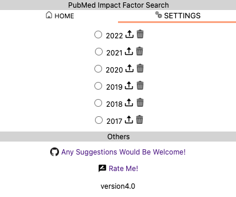
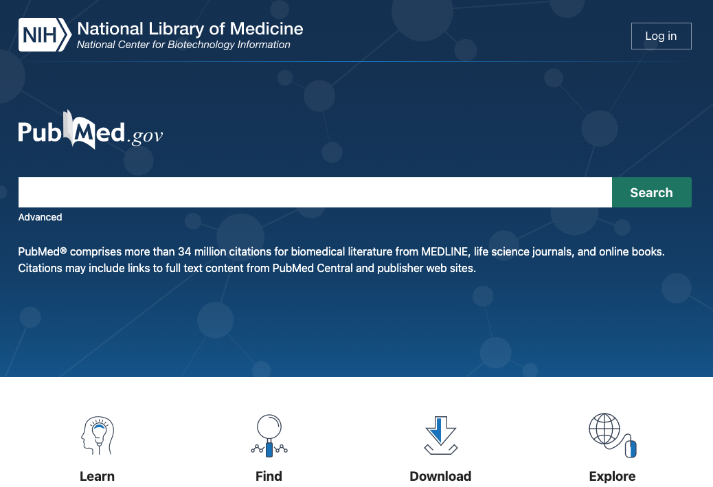
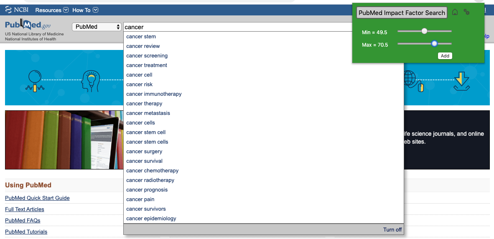
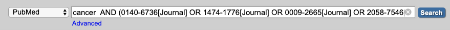

# PubMed Impact Factor Search
Add search words of journals at PubMed which has the impact factors you specified

# Installation

(1) Clone this directory OR Download as ZIP file
```bash
git clone https://github.com/tand826/pubmed_impact_factor_search
```

```
# OR download from the button in the right top of this page
```

(2) Access "chrome://extensions"

(3) From "LOAD UNPACKED", select the cloned "pubmed_impact_factor_search" directory


(4) <a href="https://jcr.clarivate.com/JCRLandingPageAction.action">InCites Journal Citation Reports</a> # This may require your registered accout.

 	(a) "Browse by Journal"

	(b) "Customize Indicators"

	(c) check the "ISSN" and save

	(d) Download CSV

(5) PubMed Impact Factor Search

	(a) Settings

	(b) Upload icon


	(c) select the downloaded CSV

# How To Use
(1) Typed some keywords at <a href="https://www.ncbi.nlm.nih.gov/pubmed/">PubMed</a>.


(2) Slide the minimum and the maximum impact factor score.


(3) Click "Add" to add the query

